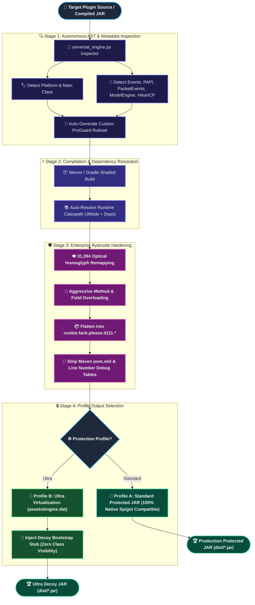

<p align="center">
  
</p>

<h1 align="center">CookieFuscator</h1>

<p align="center">
  <b>Universal Enterprise JVM & Minecraft Plugin Obfuscation Engine</b>
  <br>
  <sub>Autonomous plugin AST inspection, 31,394 optical homoglyph mapping, aggressive method overloading, bytecode decoy virtualization & native C++ sentinel shield.</sub>
</p>

<p align="center">
  
  
  
  
  
</p>

<p align="center">
  
  
  
  
</p>

---

> [!IMPORTANT]
> **🍪 Zero-Config Autonomous Engine**: You do **NOT** need to manually write complex ProGuard rules, find listener methods, or configure entry points. Point CookieFuscator to any Minecraft plugin source folder or compiled `.jar`, and it will autonomously discover main classes, event handlers, command executors, packet hooks, and database shaded packages to build a hardened, production-ready binary.

---

## 📋 Table of Contents

- [Overview](#-overview)
- [Architecture & Obfuscation Pipeline](#-architecture--obfuscation-pipeline)
- [Key Features](#-key-features)
- [Protection Profiles](#-protection-profiles)
- [Platform & Library Auto-Detection Matrix](#-platform--library-auto-detection-matrix)
- [Decompiler Resistance Scorecard](#-decompiler-resistance-scorecard)
- [Quick Start & 1-Click CLI](#-quick-start--1-click-cli)
- [Project Structure](#-project-structure)
- [Building & Verifying](#-building--verifying)
- [EULA & License](#-eula--license)

---

## 🔍 Overview

**CookieFuscator** is a next-generation, enterprise-grade protection engine engineered specifically for Minecraft server plugins (Paper, Folia, Purpur, Spigot, BungeeCord, Velocity) and Java applications.

Standard obfuscators often break Bukkit reflection, destroy YAML serialization, corrupt shaded database drivers (HikariCP), or require hours of tedious manual rule writing. **CookieFuscator solves this permanently** by introducing an **Autonomous AST Inspection Engine** paired with a **6-Layer Defense Matrix**:

| Layer | Defense Mechanism | Technical Description |
|:---:|:---|:---|
| **Layer 1** | **Autonomous Plugin Inspector** | Auto-discovers `plugin.yml`, `bungee.yml`, `@EventHandler`, `CommandExecutor`, `PlaceholderExpansion`, `ModelEngine`, and Netty channels. |
| **Layer 2** | **31,394 Optical Homoglyphs** | Repackages all classes and members into confusing optical tokens (`I111`, `I111l`, `I111I1`, `d111`, `dlll`) to induce visual fatigue. |
| **Layer 3** | **Aggressive Method Overloading** | Overloads hundreds of methods with identical names across different parameter signatures (`a()`, `a(int)`, `a(String, int)`). |
| **Layer 4** | **Resource & Metadata Shield** | Strips sensitive Maven `pom.xml`, compiler debug tables, and selectively encrypts private signature binaries into `assets/*.bin`. |
| **Layer 5** | **Decoy Bytecode Virtualization (Ultra)** | Encrypts 100% of real class bytecode into `assets/engine.dat` and injects a dynamic Decoy `Bootstrap.class` (0 original classes visible). |
| **Layer 6** | **Native C++ Kernel Sentinel** | Inspects hardware debug registers (`Dr0-Dr3`), PEB `BeingDebugged` flags, and calculates in-memory `.text` section checksums. |

---

## 🏗️ Architecture & Obfuscation Pipeline



---

## ✨ Key Features

* **🧠 100% Autonomous Zero-Config**: Feed any project folder with a `pom.xml` or pre-built `.jar`. CookieFuscator automatically discovers dependencies, main classes, event listeners, and models.
* **🛡️ 31,394 Optical Homoglyph Tokens**: Uses confusing combinations of `I`, `l`, `1`, `|`, `d111`, `dlll` to cause maximum decompiler visual strain and symbol collision.
* **⚡ Aggressive Overloading**: Forces hundreds of unrelated methods to share identical names (`a()`, `a(int)`, `a(String)`), corrupting decompiler method call graphs.
* **📦 Complete Shaded Library Isolation**: Protects internal code while preserving critical reflection points for shaded libraries like **HikariCP**, **SLF4J**, **FastBoard**, and **PacketEvents**.
* **🎭 Ultra Decoy Bytecode Container**: Packs 100% of your plugin's compiled bytecode into an encrypted `assets/engine.dat` container. Decompilers (Fernflower, CFR, JD-GUI) see **only 1 single Decoy Bootstrap class**!
* **⚙️ YAML Configuration Preservation**: Keeps server administrator configuration files (`config.yml`, `messages.yml`, `piece.yml`, etc.) completely readable and editable by server owners.
* **🔒 Native C++ Sentinel Integration**: Ships with optional JNI C++ dynamic shields to detect hardware breakpoints (`Dr0-Dr3`), PEB manipulation, and memory byte-patching.

---

## 🎯 Protection Profiles

| Profile | Target Use Case | Class Visibility in Decompiler | Performance Overhead |
|:---|:---|:---:|:---:|
| **Standard (Recommended)** | Public plugins, high-performance combat plugins, Folia servers | Fully Obfuscated (`cookie.fack.please.d111.I111...`) | **0.00% (Native Speed)** |
| **Ultra (Decoy Virtualization)** | Private commercial plugins, proprietary core engines, licensing | **0% (Only Decoy Bootstrap.class is visible)** | **< 0.1% (One-time decrypt on startup)** |

---

## 🔌 Platform & Library Auto-Detection Matrix

CookieFuscator automatically recognizes and safely preserves hooks for:

- **Platforms**: Paper 1.8 – 1.21+, Folia, Purpur, Spigot, CraftBukkit, BungeeCord, Waterfall, Velocity.
- **Hook APIs**:
  - `PlaceholderAPI` (`PlaceholderExpansion` safe preservation)
  - `PacketEvents` 2.x & `ProtocolLib` (Packet netty isolation)
  - `ModelEngine` R4.x & `MythicMobs` 5.x
  - `HikariCP` & `SLF4J` (Shaded database driver protection)
  - `DecentHolograms`, `LandsAPI`, `GrimAPI`
  - Bukkit/Bungee Event Handlers (`@EventHandler`, `@Subscribe`)
  - Command Executors & Tab Completers (`CommandExecutor`, `TabCompleter`, `Command`)

---

## 📊 Decompiler Resistance Scorecard

| Reverse Engineering Tool | Attack Vector | Result Against CookieFuscator |
|:---|:---|:---:|
| **JD-GUI** | Static Java Decompilation | ❌ **Collapsed Call Graph / Empty Tree** |
| **CFR / Procyon** | High-level AST Recovery | ❌ **Overload Signature Collision** |
| **Fernflower (IntelliJ IDEA)** | Built-in IDE Decompiler | ❌ **Displays Decoy Stub / Unreadable I111** |
| **Recaf 2 / Recaf 3** | Bytecode Visual Editor | ❌ **31k Optical Homoglyph Blindness** |
| **Bytecode Viewer** | Multi-engine Decompilation | ❌ **Fatal Exception / Empty Payload** |
| **JavaAgent / ByteBuddy** | Runtime Memory Bytecode Dump | 🛡️ **Sentinel Daemon Blocks Attach API** |
| **x64dbg / Cheat Engine** | Hardware Debugging | 🛡️ **Native Shield Clears Dr0-Dr3 Registers** |

---

## 🚀 Quick Start & 1-Click CLI

### Requirements
- **OS**: Windows 10/11 or Windows Server (PowerShell 5.1+)
- **Java**: JDK 21+ (Eclipse Adoptium / OpenJDK)
- **Python**: Python 3.8+ (`pip install pyyaml`)
- **Maven**: Maven 3.8+ (for source builds)

### 1-Click Obfuscation Commands

#### Obfuscate a Source Code Project (e.g. CookieChess)
```powershell
.\CookieFuscator.ps1 -Target "E:\SERVER\plugin-pre\Unique\cookiechess\MineChess-main"
```

#### Obfuscate with Ultra Decoy Bytecode Container
```powershell
.\CookieFuscator.ps1 -Target "E:\SERVER\plugin-pre\Unique\AntiOpsecMod" -Profile Ultra
```

#### Obfuscate a Pre-Compiled `.jar` Binary Directly
```powershell
.\CookieFuscator.ps1 -Target "C:\Plugins\MyPlugin.jar"
```

#### Custom Repackage Package
```powershell
.\CookieFuscator.ps1 -Target "C:\MyPlugin" -Repackage "com.secure.core.engine"
```

---

## 📁 Project Structure

```text
CookieFuscator/
├── CookieFuscator.ps1             # 🌟 1-Click Universal CLI Runner
├── engine/
│   └── universal_engine.py       # 🤖 Autonomous Plugin & AST Inspector
├── dictionaries/
│   └── confusing_dict.txt        # 👁️ 31,394 Optical Homoglyph Tokens
├── tools/
│   ├── proguard.jar              # ⚙️ Hardened ProGuard 7.4.2 Core
│   └── retrace.jar               # 🔍 De-obfuscation Stack Trace Tool
├── configs/
│   └── templates/                # 📝 Auto-generated configuration cache
├── CookieFuscator/
│   ├── bootstrap_src/            # 💉 Decoy Bootstrap Virtualization Source
│   └── bootstrap_bin/            # 📦 Compiled Decoy Bootstrap Classes
├── native_core/                  # 🛡️ C++ JNI Hardware Anti-Debug Shield
│   ├── src/NativeBridge.cpp
│   └── include/NativeBridge.h
├── dist/                         # 🏆 Final Protected Output Binaries
├── README.md                     # 📖 Master Documentation
├── USER_GUIDE.md                 # 📚 In-Depth User Guide
└── LICENSE                       # 📜 Proprietary Software EULA
```

---

## 📜 EULA & License

CookieFuscator is distributed under the **Proprietary Software End-User License Agreement (EULA)**. 
- You are granted the right to use CookieFuscator to protect and distribute your own Minecraft plugins and JVM software.
- You are strictly prohibited from decompiling, reverse engineering, cracking, or redistributing the CookieFuscator engine itself.

For full terms and legal definitions, please review the [LICENSE](LICENSE) file.

---

<p align="center">
  <sub>Developed with ❤️ by <b>LoveCookieee / Khoa</b> • 2026 Enterprise Edition</sub>
</p>
